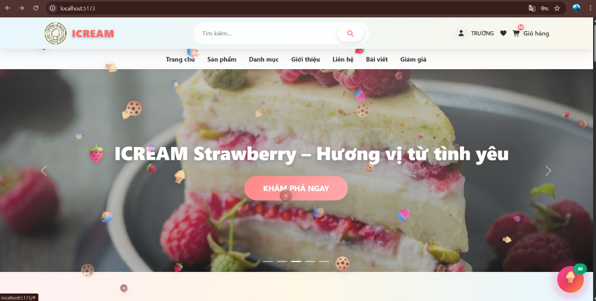

# 🍦 ICREAM - E-Commerce Platform

> **Dự án Website Thương mại Điện tử bán Kem** — Fullstack Java Spring Boot + React + AI Chatbot (Google Gemini)


---

## 📋 Mục lục

- [Giới thiệu](#-giới-thiệu)
- [Kiến trúc hệ thống](#-kiến-trúc-hệ-thống)
- [Tính năng](#-tính-năng)
- [Công nghệ sử dụng](#-công-nghệ-sử-dụng)
- [Cấu trúc dự án](#-cấu-trúc-dự-án)
- [Cài đặt và Chạy](#-cài-đặt-và-chạy)
- [Tài khoản Demo](#-tài-khoản-demo)
- [API Documentation](#-api-documentation)
- [Screenshots](#-screenshots)
- [Tác giả](#-tác-giả)

---

## 📖 Giới thiệu

**ICREAM** là một nền tảng thương mại điện tử fullstack chuyên bán kem, được thiết kế với kiến trúc **3-tier** (Backend API + Admin Dashboard + AI Chatbot). Dự án bao gồm đầy đủ các tính năng từ quản lý sản phẩm, đặt hàng, thanh toán online cho đến tích hợp trí tuệ nhân tạo hỗ trợ khách hàng.

**Mục tiêu:** Xây dựng một hệ thống e-commerce hoàn chỉnh, áp dụng các nguyên lý OOP, Design Patterns, Spring Security, và tích hợp AI để tạo trải nghiệm người dùng hiện đại.

---

## 🏗️ Kiến trúc hệ thống

```
┌──────────────────┐     ┌──────────────────┐     ┌──────────────────┐
│   React Admin    │     │   Spring Boot    │     │   Python Flask   │
│   Dashboard      │────▶│   REST API       │◀────│   AI Server      │
│   (Port 5173)    │     │   (Port 8081)    │     │   (Port 5000)    │
└──────────────────┘     └────────┬─────────┘     └──────────────────┘
                                  │                        │
                                  ▼                        ▼
                         ┌──────────────────┐     ┌──────────────────┐
                         │     MySQL        │     │  Google Gemini   │
                         │   ecommerce_db   │     │     API          │
                         └──────────────────┘     └──────────────────┘
```

---

## ✨ Tính năng

### 👤 Xác thực & Phân quyền

- Đăng ký / Đăng nhập / Đăng xuất với **JWT Token**
- Quên mật khẩu / Đặt lại mật khẩu qua email
- Phân quyền **Admin** và **Customer**
- Refresh Token để duy trì phiên đăng nhập

### 🛍️ Quản lý Sản phẩm

- CRUD sản phẩm với hình ảnh, mô tả chi tiết
- Quản lý **danh mục** (Categories) và **topping**
- Biến thể sản phẩm (Product Variants)
- Tìm kiếm và lọc sản phẩm nâng cao
- Lưu lịch sử tìm kiếm và xem gần đây

### 🛒 Giỏ hàng & Đặt hàng

- Thêm / sửa / xóa sản phẩm trong giỏ hàng
- Hỗ trợ chọn **topping** cho từng sản phẩm
- Checkout với nhiều phương thức thanh toán
- Theo dõi trạng thái đơn hàng (Pending → Confirmed → Shipping → Delivered)

### 💳 Thanh toán Online

- Tích hợp cổng thanh toán **VNPay** (Sandbox)
- Hỗ trợ thanh toán **COD** (Cash on Delivery)
- Xử lý IPN và Return URL tự động

### 🎫 Khuyến mãi & Giảm giá

- Quản lý mã giảm giá (**Discount/Voucher**)
- Hỗ trợ giảm theo phần trăm hoặc số tiền cố định
- **Deal/Flash Sale** với thời gian giới hạn
- Banner quảng cáo (Promotion Banners)

### ⭐ Đánh giá & Tương tác

- Đánh giá sản phẩm (kèm hình ảnh)
- Rating sao và comment
- Danh sách yêu thích (**Wishlist**)
- Hệ thống thông báo (Notifications)

### 🔄 Quản lý Hoàn hàng

- Khách hàng yêu cầu hoàn trả sản phẩm
- Admin duyệt / từ chối yêu cầu hoàn trả

### 🤖 AI Chatbot (Google Gemini)

- Trợ lý ảo hỗ trợ khách hàng đặt hàng
- Nhận diện **hình ảnh** và **giọng nói**
- Tự động thêm sản phẩm vào giỏ hàng qua chat
- Gợi ý topping phù hợp

### 📊 Admin Dashboard

- **Dashboard** tổng quan doanh thu, đơn hàng
- Quản lý sản phẩm, danh mục, đơn hàng
- Quản lý người dùng và phân quyền
- Quản lý kho hàng (**Inventory**)
- Thống kê doanh thu chi tiết (**Statistics**)
- Quản lý blog, liên hệ, banner quảng cáo
- Chương trình khách hàng thân thiết (**Loyalty**)

---

## 🛠️ Công nghệ sử dụng

### Backend (Spring Boot)

| Công nghệ             | Mô tả                                 |
| --------------------- | ------------------------------------- |
| **Java 17**           | Ngôn ngữ lập trình chính              |
| **Spring Boot 3.3.4** | Framework phát triển backend          |
| **Spring Security**   | Xác thực và phân quyền (JWT)          |
| **Spring Data JPA**   | ORM với Hibernate                     |
| **MySQL**             | Cơ sở dữ liệu quan hệ                 |
| **Lombok**            | Giảm boilerplate code                 |
| **Springdoc OpenAPI** | Tự động generate API docs (Swagger)   |
| **Spring Mail**       | Gửi email (reset password, thông báo) |
| **Apache POI**        | Xử lý file Excel (nhập kho)           |
| **JaCoCo**            | Code coverage (Unit Test)             |
| **Maven**             | Build tool                            |

### Frontend - Admin Dashboard (React)

| Công nghệ                         | Mô tả                   |
| --------------------------------- | ----------------------- |
| **React 19**                      | Thư viện UI             |
| **Vite**                          | Build tool nhanh        |
| **React Router DOM 7**            | Routing                 |
| **Axios**                         | HTTP Client             |
| **Bootstrap 5 + React-Bootstrap** | UI Framework            |
| **Recharts**                      | Biểu đồ thống kê        |
| **Framer Motion**                 | Animation               |
| **React Quill**                   | Rich Text Editor (Blog) |
| **SweetAlert2**                   | Dialog/Notification     |

### AI Server (Python)

| Công nghệ             | Mô tả                         |
| --------------------- | ----------------------------- |
| **Python 3**          | Ngôn ngữ lập trình            |
| **Flask**             | Web framework                 |
| **Google Gemini API** | Mô hình AI (gemini-2.5-flash) |
| **Pillow (PIL)**      | Xử lý hình ảnh                |

---

## 📁 Cấu trúc dự án

```
java_da/
├── ecommerce-backend-project/     # 🔧 Backend Spring Boot
│   ├── src/
│   │   ├── main/java/com/nhom25/ecommerce/
│   │   │   ├── config/            # Cấu hình (CORS, Swagger, ...)
│   │   │   ├── controller/        # 23 REST Controllers
│   │   │   ├── dto/               # Data Transfer Objects
│   │   │   ├── entity/            # 34 JPA Entities
│   │   │   ├── exception/         # Global Exception Handler
│   │   │   ├── repository/        # JPA Repositories
│   │   │   ├── security/          # JWT Filter, Auth Config
│   │   │   ├── service/           # Business Logic
│   │   │   └── util/              # Utility classes
│   │   ├── main/resources/
│   │   │   ├── application.yml    # Cấu hình chính
│   │   │   ├── application-dev.yml
│   │   │   └── application-prod.yml
│   │   └── test/                  # Unit & Integration Tests
│   └── pom.xml
│
├── ecommerce-manager/             # 🎨 Frontend React (Admin + Client)
│   ├── src/
│   │   ├── api/                   # API services
│   │   ├── components/            # Reusable components
│   │   │   ├── FloatingChatWidget.jsx  # AI Chat Widget
│   │   │   ├── ProductCard.jsx
│   │   │   └── layout/            # Header, Footer, Sidebar
│   │   ├── pages/
│   │   │   ├── admin/             # 17 Admin pages
│   │   │   └── client/            # 21 Client pages
│   │   ├── context/               # React Context (Auth, ...)
│   │   └── hooks/                 # Custom hooks
│   ├── package.json
│   └── vite.config.js
│
├── ServerAI/                      # 🤖 AI Chatbot Server (Flask)
│   └── main.py                    # Gemini AI integration
│
├── ecommerce_db.sql               # 💾 Database SQL dump
└── README.md                      # 📄 Tài liệu này
```

---

## 🚀 Cài đặt và Chạy

### Yêu cầu hệ thống

| Phần mềm    | Phiên bản  |
| ----------- | ---------- |
| **JDK**     | 17 trở lên |
| **Maven**   | 3.8+       |
| **Node.js** | 18+        |
| **npm**     | 9+         |
| **MySQL**   | 8.0+       |
| **Python**  | 3.9+       |

### Bước 1: Clone dự án

```bash
git clone https://github.com/nguyentructruong2308-beep/java.git
cd java
```

### Bước 2: Cài đặt Database

```bash
# Tạo database
mysql -u root -p -e "CREATE DATABASE IF NOT EXISTS ecommerce_db CHARACTER SET utf8mb4 COLLATE utf8mb4_unicode_ci;"

# Import dữ liệu mẫu
mysql -u root -p ecommerce_db < ecommerce_db.sql
```

> **Lưu ý:** Nếu bạn không import file SQL, khi chạy backend với profile `dev`, hệ thống sẽ tự động tạo bảng và seed dữ liệu mẫu.

### Bước 3: Cấu hình Backend

Mở file `ecommerce-backend-project/src/main/resources/application.yml` và cập nhật:

```yaml
spring:
  datasource:
    url: jdbc:mysql://localhost:3306/ecommerce_db?useSSL=false&serverTimezone=UTC&allowPublicKeyRetrieval=true
    username: root
    password: YOUR_MYSQL_PASSWORD # ← Đổi thành password MySQL của bạn
```

### Bước 4: Chạy Backend

```bash
cd ecommerce-backend-project
mvn spring-boot:run
```

> Backend sẽ chạy tại: **http://localhost:8081**

### Bước 5: Chạy Frontend

```bash
cd ecommerce-manager
npm install
npm run dev
```

> Frontend sẽ chạy tại: **http://localhost:5173**

### Bước 6: Chạy AI Server (Tùy chọn)

```bash
cd ServerAI
pip install flask flask-cors google-genai Pillow requests
python main.py
```

> AI Server sẽ chạy tại: **http://localhost:5000**

> **⚠️ Lưu ý:** Để sử dụng AI Chatbot, bạn cần có **Google Gemini API Key**. Cập nhật key trong file `ServerAI/main.py` tại biến `API_KEY`.

---

## 👤 Tài khoản Demo

Khi chạy với dữ liệu mẫu (import SQL hoặc profile `dev`), hệ thống có sẵn các tài khoản:

| Vai trò      | Email                    | Mật khẩu      |
| ------------ | ------------------------ | ------------- |
| **Admin**    | `admin@ecommerce.com`    | `admin123`    |
| **Customer** | `customer@ecommerce.com` | `customer123` |

---

## 📚 API Documentation

Sau khi chạy backend, truy cập **Swagger UI** để xem toàn bộ API:

🔗 **http://localhost:8081/swagger-ui.html**

### Các nhóm API chính:

| API Group         | Endpoint               | Mô tả                             |
| ----------------- | ---------------------- | --------------------------------- |
| **Auth**          | `/api/auth/*`          | Đăng ký, đăng nhập, refresh token |
| **Products**      | `/api/products/*`      | CRUD sản phẩm                     |
| **Categories**    | `/api/categories/*`    | CRUD danh mục                     |
| **Cart**          | `/api/cart/*`          | Giỏ hàng                          |
| **Orders**        | `/api/orders/*`        | Đặt hàng, theo dõi                |
| **Payments**      | `/api/payments/*`      | VNPay, COD                        |
| **Reviews**       | `/api/reviews/*`       | Đánh giá sản phẩm                 |
| **Discounts**     | `/api/discounts/*`     | Mã giảm giá                       |
| **Users**         | `/api/users/*`         | Quản lý người dùng                |
| **Wishlist**      | `/api/wishlist/*`      | Danh sách yêu thích               |
| **Toppings**      | `/api/toppings/*`      | Topping sản phẩm                  |
| **Statistics**    | `/api/statistics/*`    | Thống kê doanh thu                |
| **Blog**          | `/api/blogs/*`         | Quản lý blog                      |
| **Notifications** | `/api/notifications/*` | Thông báo                         |
| **Search**        | `/api/search/*`        | Tìm kiếm                          |

---

## 🧪 Chạy Test

```bash
cd ecommerce-backend-project

# Chạy tất cả Unit Tests
mvn test

# Chạy test với coverage report (JaCoCo)
mvn test jacoco:report

# Report được tạo tại: target/site/jacoco/index.html
```

---

## 📸 Screenshots

### 🏠 Trang chủ (Homepage)



---

## 🔧 Cấu hình bổ sung

### VNPay (Thanh toán Online)

Dự án sử dụng **VNPay Sandbox** cho thanh toán online. Để test, cần cấu hình trong `application.yml`:

```yaml
vnpay:
  tmnCode: "YOUR_SANDBOX_TMNCODE"
  hashSecret: "YOUR_SANDBOX_HASHSECRET"
```

### Email (Reset Password)

Cấu hình SMTP trong `application.yml` để gửi email reset mật khẩu:

```yaml
spring:
  mail:
    host: smtp.gmail.com
    port: 587
    username: "your_email@gmail.com"
    password: "your_app_password"
```

---

## 📝 Ghi chú

- Dự án sử dụng **Hibernate `ddl-auto: update`**, tự động tạo/cập nhật bảng khi khởi động
- File `ecommerce_db.sql` chứa đầy đủ dữ liệu mẫu để chạy demo
- AI Chatbot hỗ trợ nhận diện **hình ảnh** và **giọng nói** (audio)
- CORS đã được cấu hình cho phép frontend gọi API từ `localhost:5173`

---

## 👨‍💻 Tác giả

- **Nguyễn Truc Trường** — _Fullstack Developer_
- 📧 Email: [nguyentructruong2308@gmail.com](mailto:nguyentructruong2308@gmail.com)
- 🔗 GitHub: [github.com/nguyentructruong2308-beep](https://github.com/nguyentructruong2308-beep)

---

## 📄 License

Dự án này được phân phối dưới giấy phép **MIT License**. Xem file [LICENSE](LICENSE) để biết thêm chi tiết.

---

<p align="center">
  ⭐ Nếu dự án hữu ích, hãy cho mình một <b>Star</b> nhé! ⭐
</p>
